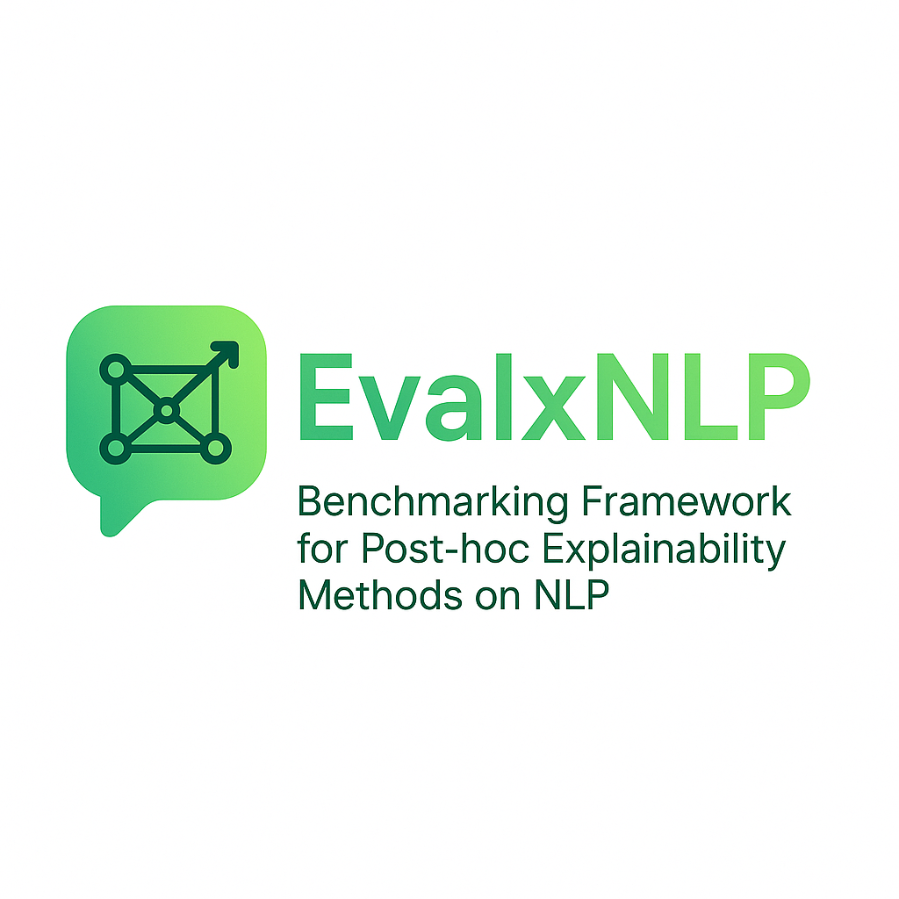

<p align="center">
 
</p>
<h1 align="center">
  <span>EvalxNLP</span>
</h1>
<h2 align="center">
  <span">Benchmarking Framework for Explainability Methods on NLP</span>
</h3>

<p align="center">
  
  
</p>

This is the repository for the paper: "EvalxNLP: A Framework for Benchmarking Post-Hoc
Explainability Methods on NLP Models". 

- Paper: TBA
- Documentation: TBA

A comprehensive toolbox for benchmarking explainability techniques on NLP classification models, featuring:
- Multiple explanation methods
- Quantitative evaluation metrics
- Natural language interpretation via LLMs
- Interactive visualization

## Table of Contents
- [Key Features](#key-features)
- [Installation](#installation)
- [Quick Start](#quick-start)
- [Advanced Usage](#advanced-usage)
- [Tutorials](#tutorials)

## Key Features

### 🧠 Supported Explainers
| Method | Paper |
|--------|-------|
| Saliency | [Simonyan et al. (2014)](https://arxiv.org/abs/1312.6034) |
| GradientxInput | [Simonyan et al. (2014)](https://arxiv.org/abs/1312.6034) |
| DeepLift | [Shrikumar et al. (2019)](https://arxiv.org/abs/1704.02685) |
| Guided BackProp | [Springenberg et al. (2015)](https://arxiv.org/abs/1412.6806) |
| Integrated Gradients | [Sundararajan et al. (2017)](https://arxiv.org/abs/1703.01365) |
| SHAP | [Lundberg & Lee (2017)](https://arxiv.org/abs/1705.07874) |
| LIME | [Ribeiro et al. (2016)](https://arxiv.org/abs/1602.04938) | 
| SHAP-I | [Muschalik et al. (2024)](https://arxiv.org/abs/2410.01649) |


### 📊 Evaluation Metrics
**Faithfulness**
- Soft Comprehensiveness ([Zhao & Aletras 2023](https://aclanthology.org/2023.acl-long.261/))
- Soft Sufficiency ([Zhao & Aletras 2023](https://aclanthology.org/2023.acl-long.261/))
- FAD ([Ngai & Rudzicz 2022](https://aclanthology.org/2022.bionlp-1.33))
- AUCTP ([Atanasova 2020](https://arxiv.org/abs/2009.13295))

**Plausibility** 
- Token F1 score ([DeYoung et al. 2020](https://aclanthology.org/2020.acl-main.408/))
- IOU F1 score ([DeYoung et al. 2020](https://aclanthology.org/2020.acl-main.408/))
- AUPRC ([DeYoung et al. 2020](https://aclanthology.org/2020.acl-main.408/))

**Complexity**
- Sparseness ([Chalasani et al. 2020](https://arxiv.org/abs/1810.06583))
- Complexity ([Bhatt et al. 2020](https://arxiv.org/abs/2005.00631))

### 💡 LLM Interpretation
- Automatic natural language explanations from LLMs
- HTML/JSON output formats
- Jupyter notebook integration

## Installation

```bash
git clone https://github.com/kafaite24/EvalxNLP.git
cd EvalxNLP
pip install -r requirements.txt
```

## Quick Start

Below are the steps on how you can use the framework to generate, visualize, interpret and benchmark explanations for single sentences or entire/sub-samples of the datasets:

#### 🛠️ 1. Initialize (Common First Step)

```python
from evalxnlp import XAIFramework
from transformers import AutoModelForSequenceClassification, AutoTokenizer
from explainers import DeepLiftExplainer, GuidedBackpropExplainer
from evaluators import AUCTPEvaluator, SoftComprehensivenessEvaluator, FADEvaluator, SparsenessEvaluator


model_name = "cardiffnlp/twitter-xlm-roberta-base-sentiment"
tokenizer = AutoTokenizer.from_pretrained(model_name)
model = AutoModelForSequenceClassification.from_pretrained(model_name)

gb= GuidedBackpropExplainer(model,tokenizer)
dl= DeepLiftExplainer(model,tokenizer)

sc= SoftComprehensivenessEvaluator(model,tokenizer)
fad= FADEvaluator(model,tokenizer)
sp= SparsenessEvaluator(model,tokenizer)
auctp= AUCTPEvaluator(model,tokenizer)

xai_framework = XAIFramework(model, tokenizer,explainers=[gb,dl], evaluators=[auprc,auctp,sc,fad,sp,cx,iou])
```
The `XAIBenchmark` class is the main entry point for the framework. It requires the model and tokenizer, and optionally explainers and evaluators. If not specified, it defaults to all available explainers and evaluators.

### 🔍 Single Instance

#### 2. Generate Explanations
```python
sentence= "A masterpiece of how not to make a movie."
xai_framework.classify_text(sentence)
exps= xai_framework.explain(input_data=sentence,target_label="positive")
```
This returns list of Explanation objects for each explainer defined during initialization. The Explanation object includes the sentence text, tokens, importance scores, explainer name, target label, and optional rationale.

#### 3. Visualize Explanations
```python
xai_framework.visualize(exps)
```
This will generate a heatmap showing the importance scores for each token in the input sentence.

#### 4: Understanding Explanation Scores

```python
from LLMExplanationGenerator import LLMExplanationGenerator
import pandas as pd
from IPython.display import display, HTML

api_key = "XXX"
explainer = LLMExplanationGenerator(api_key=api_key)

# Generate and save explanations (returns both explanations and file paths)
explanations, saved_files = explainer.generate_and_save_explanations(
    exps=exps,
    output_format="both"  # or "json"/"html"
)

# Display in notebook
explainer.display_explanations(explanations)

# Print saved locations
print(f"Saved files: {[str(p) for p in saved_files]}")
```

The `generate_and_save_explanations()` function saves LLM-generated explanations to `../results/llm_explanations/` in both JSON (structured data) and HTML (visualized report) formats, while the `display_explanations()` function renders interactive LLM explanations directly in Jupyter notebooks for immediate analysis.

#### 5: Evaluate Explanations

```python
eval_metrics=xai_framework.evaluate_single_sentence(sentence, target_label="positive")
```

#### 6: Visualize Results

```python
xai_framework.create_pivot_table(eval_metrics, save_path="../results/testing_1.xlsx")
```

#### 7: Understanding Evaluation Metrics

```python
from EvaluationMetricsExplainer import EvaluationMetricsExplainer

api_key = "XXX"
explainer = EvaluationMetricsExplainer(api_key=api_key)

results = explainer.explain_results(eval_metrics)
json_path, html_path = explainer.save_results(results)
explainer.display_results(results)
```
The `save_results()` function saves LLM-generated explanations to `../results/llm_explanations/` in both JSON (structured data) and HTML (visualized report) formats, while the `display_results()` function renders interactive LLM explanations directly in Jupyter notebooks for immediate analysis.

### 📊 Dataset (Entire/Multiple Instances)

Users can explain and benchmark datasets from Hugging Face or local files (e.g., CSV or Excel) using the [DatasetLoader] class. The framework supports text classification tasks, such as sentiment analysis, hate speech detection, and natural language inference.

#### 2. Loading the Dataset

```python
from dataset_loaders.dataset_args import LoadDatasetArgs

dataset_args_ = LoadDatasetArgs( # Path to the dataset file
    # dataset_name= "csv",
    dataset_name="eraser-benchmark/movie_rationales",
    text_field="review",  # Assuming "text" column contains the text data
    label_field="label",  # Assuming "label" column contains the sentiment labels
    rationale_field="evidences",
    dataset_split="test",  # Assuming you want to load the test split
    # dataset_files=["healthFC_annotated.csv"]
)

# Load the dataset fields
results = load_fields_from_dataset(dataset_args_)
```

#### 3. Data Post-Processing

For datasets requiring format conversion, we provide specialized processors. Below is an example for the [Movie Reviews](https://huggingface.co/datasets/eraser-benchmark/movie_rationales) dataset:

```python
from dataset_loaders.movie_rationales import MovieRationalesProcessor

input_texts= results['text']
labels= results['labels']
rationales= results['rationales']

mv= MovieRationalesProcessor(tokenizer)
processed_rationales= mv.process_dataset(input_texts, labels, rationales)
```

#### 4. Generate Explanations

```python
#Select a sub-sample if you want
input_texts_sample=results['text'][:2]
labels_sample=results['labels'][:2]
rationale_sample= processed_rationales[:2]

exp_scores= xai_framework.get_feature_importance_for_dataset(input_texts_sample,labels_sample,rationale_sample,output_file="../results/scores/xxx.json")
```
For multiple sentences as input, results are saved to your specified output file, including for each input: the original text, tokenized output, importance scores, explainer method used, and target model label.

#### 5. Understanding Importance Scores

```python
api_key = "XXX"
explainer = LLMExplanationGenerator(api_key=api_key)
explanations, saved_files = explainer.generate_and_save_explanations(
    exps=exp_scores,
    output_format="html"
)
explainer.display_explanations(explanations)
print(f"Saved files: {[str(p) for p in saved_files]}")
```

#### 6. Evaluate Explanations

```python
metrics= xai_framework.compute_evaluation_metrics(exp_scores)
```

#### 7. Visualize Metrics

```python
xai_framework.create_pivot_table(metrics, save_path="../results/testing.xlsx")
```

#### 8. Understanding Metrics

```python
api_key = "XXX"
explainer = EvaluationMetricsExplainer(api_key=api_key)
results = explainer.explain_results(metrics)
json_path, html_path = explainer.save_results(results)
explainer.display_results(results)
```

## GPU Usage

### GPU

To enable GPU acceleration for explanation generation and metric computation, ensure your model and framework components are properly initialized on the target device as follows:

```python
device = "cuda" if torch.cuda.is_available() else "cpu"

model_name = "cardiffnlp/twitter-xlm-roberta-base-sentiment"
tokenizer = AutoTokenizer.from_pretrained(model_name)
model = AutoModelForSequenceClassification.from_pretrained(model_name).to(device)

ig= IntegratedGradientsExplainer(model,tokenizer,device=device)
sc= SoftComprehensivenessEvaluator(model,tokenizer,device=device)

xai_framework = XAIFramework(model, tokenizer,explainers=[ig], evaluators=[sc], device=device)
```

## Tutorials

Further tutorials are available that demonstrate usage of the library for different usecases. Please see notebooks in the examples folder which include:

|📚 Notebook |Tutorials |
|--------|-------|
| [Sentiment Analysis example](./examples/tutorial_sentiment_analysis.ipynb) |	Benchmarking movie reviews |
| [Hate Speech Detection example](./examples/tutorial_hate_speech_detection.ipynb)	| Evaluating sensitive content |
| [Natural Language Inference example](./examples/tutorial_nli.ipynb) | Analyzing premise-hypothesis relationships |
